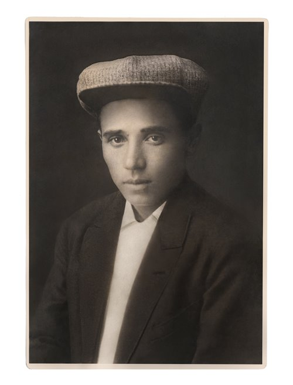
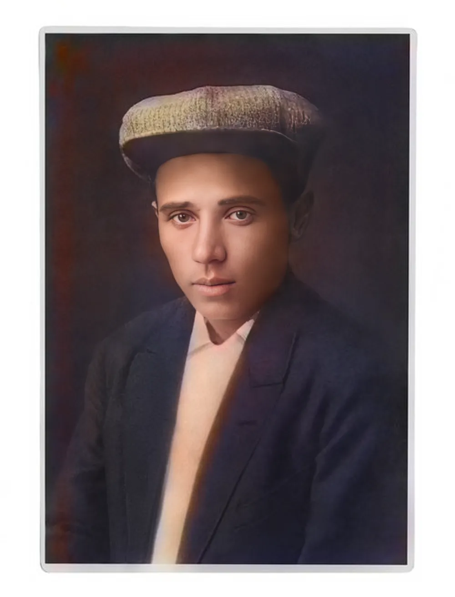
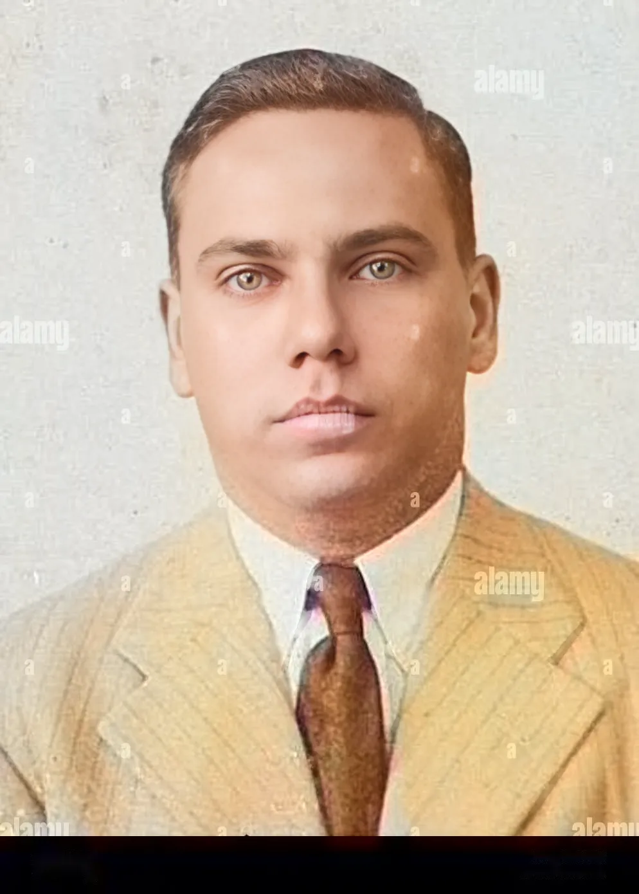
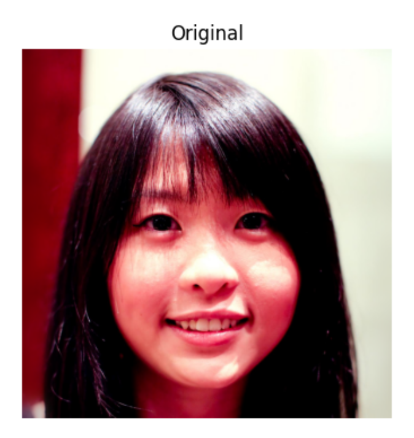
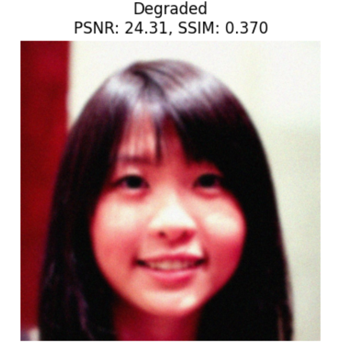
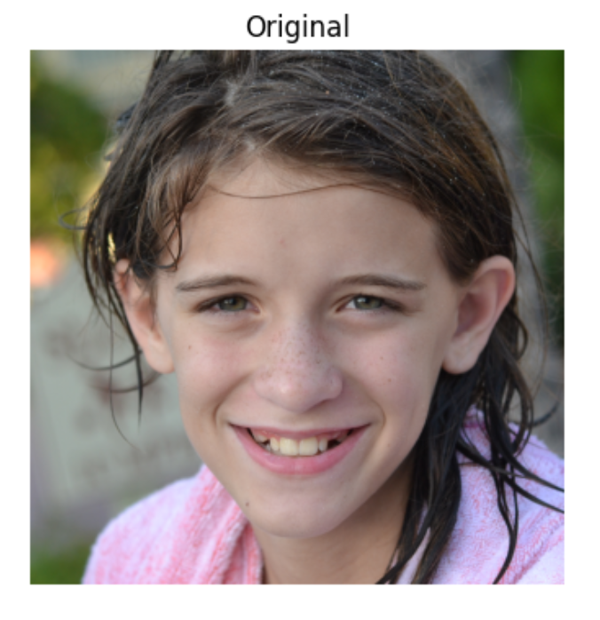
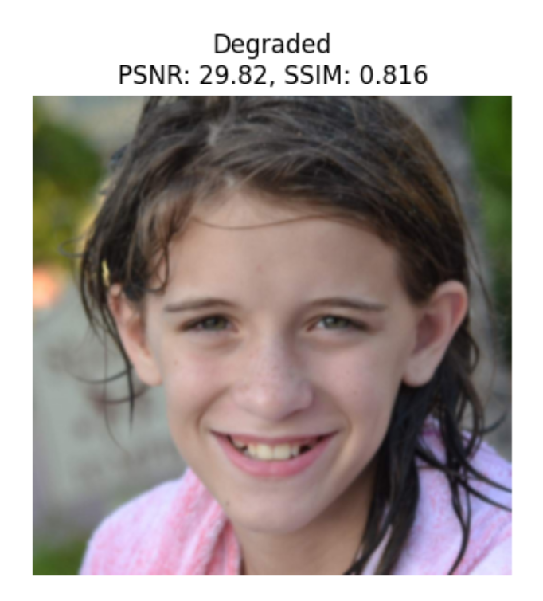

# TimeLens — Auto Enhance
Face restoration with **GFPGAN** + automatic **colorization** (B/W → color) + automatic **de-scratch** (inpainting).  
**Zero settings:** just upload a photo → click **Enhance**.

> 🧠 The app makes automatic decisions per image (whether to colorize, how much de-scratch, safe order, and upscale factor).

---

## Table of Contents
- [Features](#-features)
- [Quick Start (macOS + Conda)](#-quick-start-macos--conda)
- [Examples](#-examples)
- [Troubleshooting](#-troubleshooting)
- [Data Analysis (pre-project)](#data-analysis-pre-project)
- [Credits](#-credits)

---

## ✨ Features
- ✅ **GFPGAN** face restoration (safe defaults)
- 🎨 **Auto colorization** for B/W photos (OpenCV DNN, Zhang et al.)
- 🧽 **Auto de-scratch** (background inpainting while protecting faces)
- ⬆️ **Auto upscale** (based on image size)
- 🖥️ Simple Gradio UI (runs locally on macOS CPU)

---

## 🚀 Quick Start (macOS + Conda)
```bash
# 0) Clone your repo (or download ZIP and open folder)
cd <your-repo-folder>

# 1) Create & activate environment
conda create -n timelens python=3.10 -y
conda activate timelens
python -m pip install -U pip setuptools wheel

# 2) Install deps (PyTorch CPU + project libs)
pip install -r requirements.txt

# 3) Run
python app.py
# Open the link printed in Terminal (usually http://127.0.0.1:7860/)
```

---

## 🖼️ Examples
| Before | After | 
|---|---| 
|  |  | 
|  |  | 
|  |  |


## Data Analysis (pre-project)
What this is. Before building the app, we ran a small analysis to demonstrate the idea:
use clean high-quality images → synthetically degrade them (blur/noise/JPEG/scratches) →
attempt restoration → compare against the clean originals with objective metrics.
Notebook. See notebooks/Image_Quality_Analysis.ipynb.
This is documentation only and does not affect the app.

### A) Clean vs Degraded
Shows what the synthetic corruption looks like.

| Clean (HQ) | Degraded (synthetic) | 
|---|---| 
|  |  | 
|  |  | 


