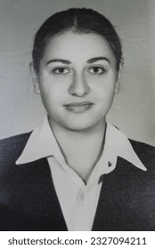
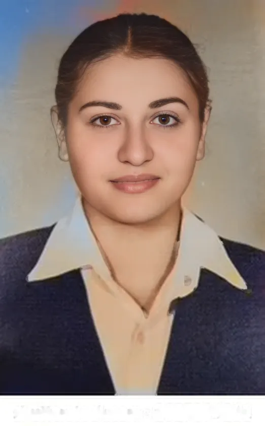
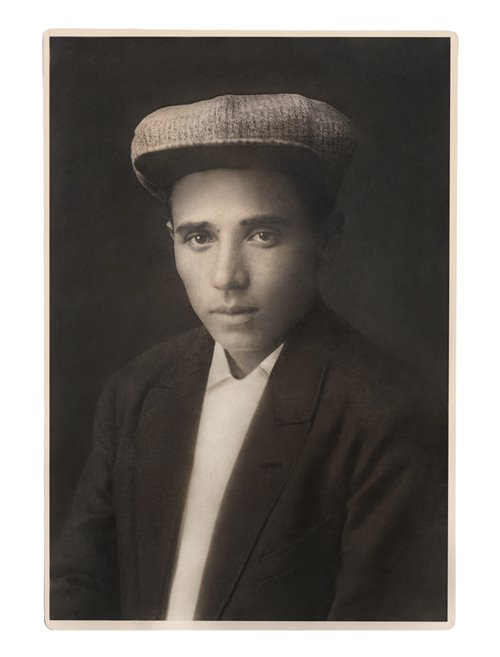
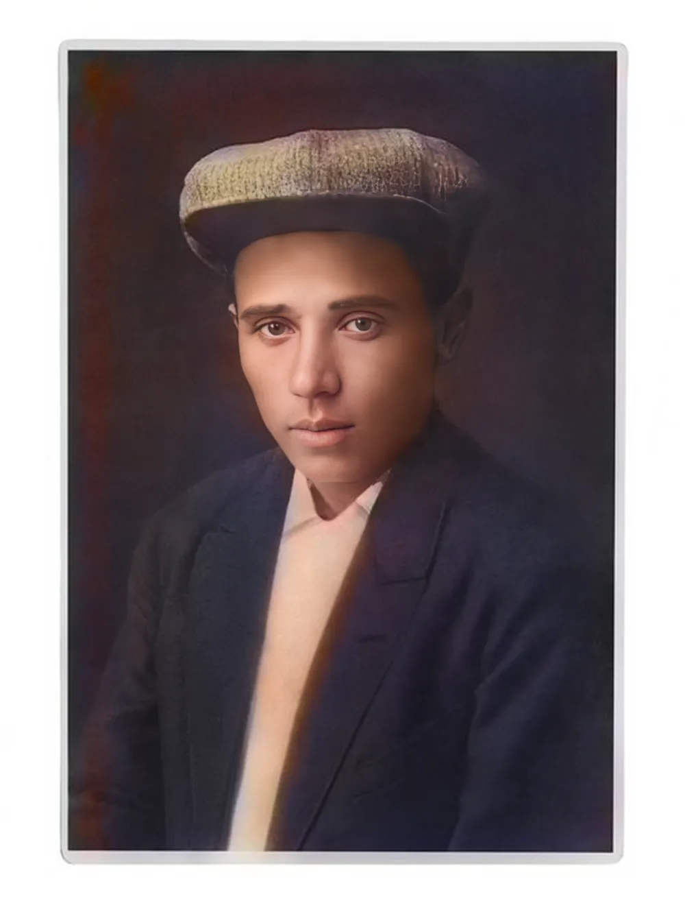
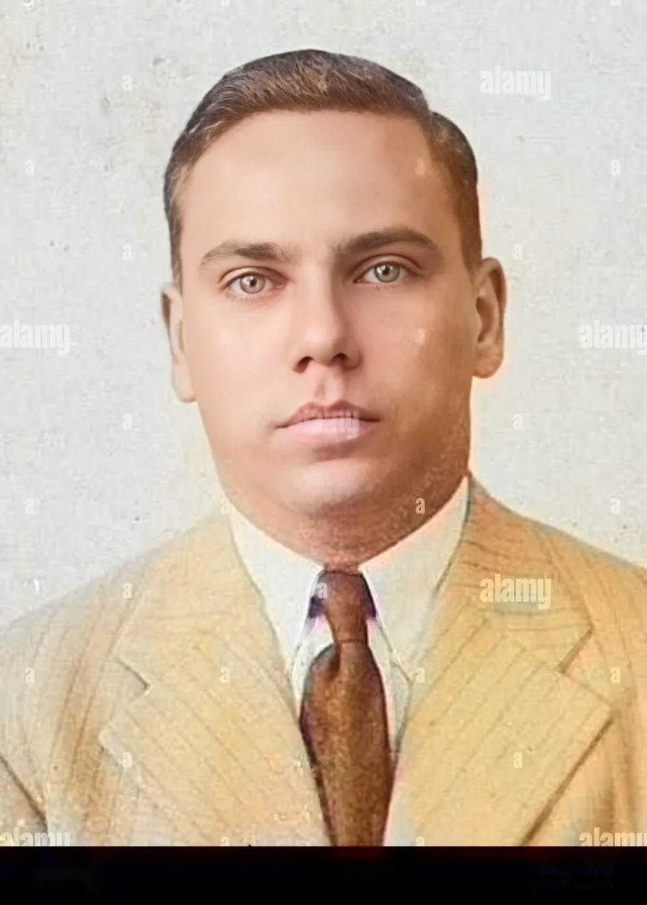

# 🕰️ TimeLens — Revive Memories ✨
*A collaborative project by **Rawan Alghannam** & **Hadeel Al-Ghassab**

Bring your old photos back to life with AI.

This app restores faces 👩‍🦰, colorizes black & white photos 🖼️, removes scratches 🩹, and upscales images 🔍 — all automatically.

👉 Live Demo:  [TimeLens on Hugging Face](https://timelens1-timelens.hf.space)

---

## ✨ Features
- ✅ **GFPGAN** for high-quality face restoration (v1.3, safe defaults).
- 🎨 **Automatic colorization** for black & white photos (OpenCV DNN — Zhang et al.).
- 🧽 ** Scratch removal** (background inpainting while protecting faces)
- ⬆️ **Smart upscaling** (adaptive, based on input size).
- 🌐 **Web Demo** hosted on Hugging Face Spaces.

---

## 🚀 Quick Start (macOS + Conda)
```bash
# 0) Clone your repo (or download ZIP and open folder)
cd <your-repo-folder>

# 1) Create & activate environment
conda create -n timelens python=3.10 -y
conda activate timelens
python -m pip install -U pip setuptools wheel

# 2) Install deps (PyTorch CPU + project libs)
pip install -r requirements.txt

# 3) Run
python app.py
# Open the link printed in Terminal (usually http://127.0.0.1:7860/)
```
---

## 🖼️ Examples


| Before                                  | After                                   |
| --------------------------------------- | --------------------------------------- |
|  |  |
|  |  |
|  |  |


---

## 🧯 Troubleshooting

* **Slow on first run** → the app downloads model weights once (hundreds of MB).
* **Module errors** → ensure the env is active: `conda activate timelens`, then `pip install -r requirements.txt`.
* **No colorization on some photos** → the app only colorizes true B/W or very low-saturation images to avoid over-coloring already-colored photos.

---
💡 Made with love by Rawan Alghannam & Hadeel Al-Ghassab | Graduation Project 🎓
